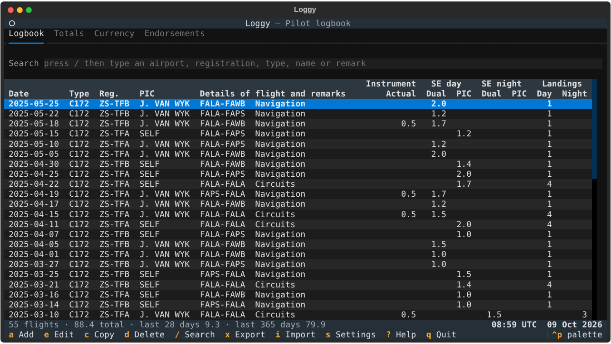
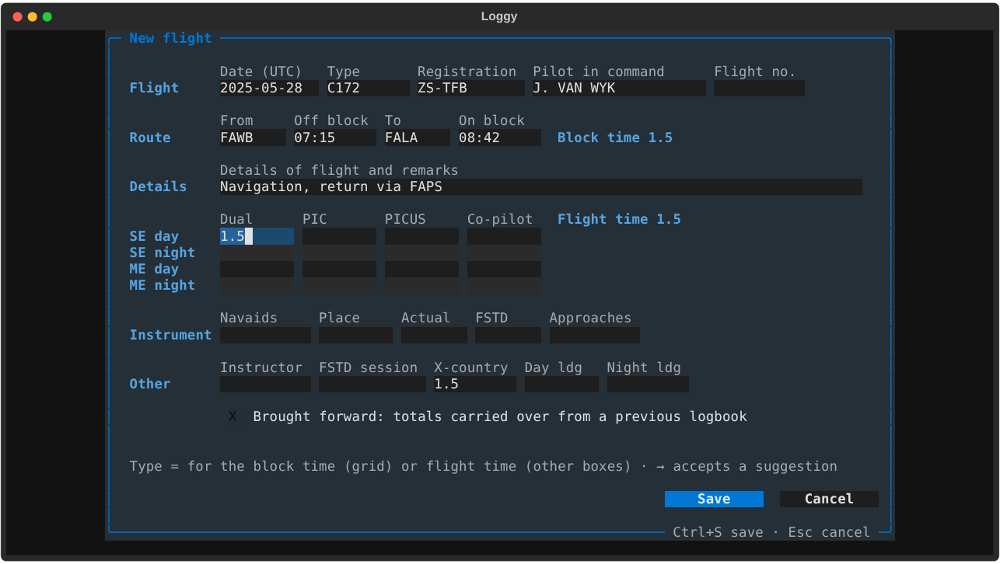
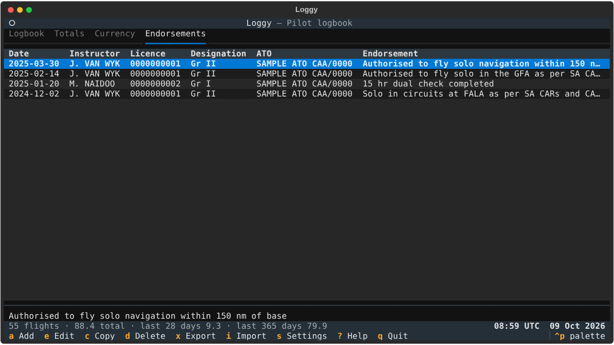
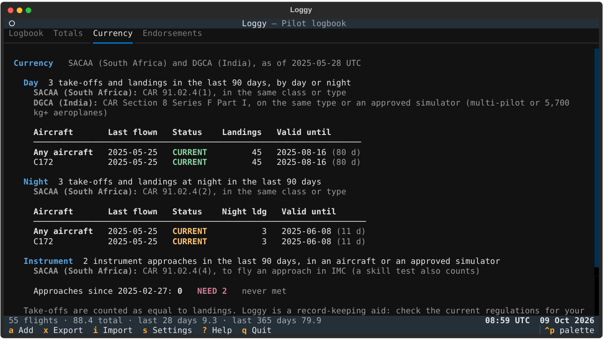

# Loggy

A pilot's logbook that runs in the terminal. It works on Windows (Windows Terminal,
PowerShell or the classic command prompt), and on macOS and Linux too.



- **Laid out like a South African (SACAA) logbook**: date, type, registration, pilot in
  command, details of flight and remarks; instrument navaids, place, actual and FSTD time;
  instructor time; FSTD; the sixteen flight-time columns (single- and multi-engine, by day
  and by night, as dual, PIC, PICUS or co-pilot); and day and night landings. Times are in
  decimal hours, and columns you have never used stay out of the way. A standard layout is
  in Settings too.
- **Every logbook column underneath**: route, off- and on-block times (UTC), flight number,
  single-pilot SE/ME and multi-pilot time, IFR, simulated instrument, cross-country and
  approaches as well. That covers SACAA, DGCA, EASA/ICAO and FAA style logbooks.
- **Quick entry**: put the time in the column for your role, or type `=` there to copy the
  block time from the off- and on-block times (flights past midnight included). A new
  flight starts from your last one: same aircraft, PIC and role, departing where you last
  landed. Airports, registrations, types and names are suggested as you type, and a known
  registration fills in its aircraft type.
- **Endorsements**: your instructors' endorsements (solo, navigation, dual checks, skills
  tests) with their licence numbers, grades and ATOs, on a tab of their own.
- **Totals**: grand totals; day and night time by role, single- and multi-engine, the way
  South African and Indian logbooks add it up; rolling 7/28/90-day, 6-month, 365-day and
  calendar-year totals; and totals by aircraft type and by year.
- **Currency** under SACAA and DGCA rules (or EASA/ICAO and FAA): take-off and landing
  currency by day and night, for any aircraft and for each type, plus instrument approaches,
  each with its regulation reference and the date it runs out.
- **Your data stays yours**: a single file on your computer, backed up automatically each day.
  CSV import and export works with Excel and with most other logbook apps.
- **Previous logbooks**: carry over the totals from a paper logbook as brought-forward entries.

## Install on Windows

1. Install Python 3.9 or newer from [python.org](https://www.python.org/downloads/). On the
   first screen of the installer, tick **Add python.exe to PATH**.
2. Download Loggy: on GitHub choose **Code → Download ZIP** and unzip it somewhere, such as
   your Documents folder. Or `git clone` it.
3. Double-click **`loggy.bat`**.

The first start takes a minute while it installs what it needs into a `.venv` folder next to
the program. After that it starts straight away. Pin a shortcut to `loggy.bat` on your Start
menu or taskbar if you like.

Loggy looks best in [Windows Terminal](https://aka.ms/terminal), which is the default on
Windows 11. A window of at least 120 × 30 characters shows everything at once; smaller
windows scroll.

### Other ways to install

With Python already set up, you can install Loggy as a command instead:

```
py -m pip install .
loggy
```

(`python -m pip install .` on macOS and Linux.) If the `loggy` command is not found, run
`py -m loggy` instead.

## Using Loggy

| Key | Does |
| --- | --- |
| `a` | add a flight (on the Endorsements tab, an endorsement) |
| `Enter` or `e` | edit the selected flight or endorsement |
| `c` | copy the selected flight as a new one (same aircraft and route, today's date), or start a new endorsement from the same instructor |
| `d` | delete the selected flight or endorsement (asks first) |
| `/` | search; `Esc` clears it |
| `←` `→` | scroll a wide logbook sideways; the date, type and registration stay in view |
| `1` `2` `3` `4` | Logbook, Totals, Currency and Endorsements tabs |
| `x` / `i` | export to / import from CSV |
| `s` | settings: the logbook layout; decimal hours or hours and minutes; which authorities' currency rules to check |
| `?` | help |
| `q` | quit |

The colour theme can be changed with `Ctrl+P` → *Theme*, and Loggy remembers your choice.

### Entering a flight



The form follows the logbook's columns:

- All times are **UTC**. Type clock times as `0930`, `930` or `09:30`, and durations as
  `1.5`, `1:30` or `130`.
- Put the flight time in the box for your role in the grid: **SE** (single-engine) or **ME**
  (multi-engine), by **day** or **night**, as **Dual**, **PIC**, **PICUS** (pilot in command
  under supervision) or **Co-pilot**. A flight that was partly at night uses two boxes, such
  as SE day dual 1.0 and SE night dual 0.5. Loggy adds them up as the flight time.
- Type **`=`** in a grid box to copy the block time worked out from the off- and on-block
  times. In any other time box (instrument, instructor, cross-country and so on), `=` copies
  the flight time. A box that holds the whole flight *follows* it: correct the on-block time
  and those boxes update too.
- A new flight starts from your last one: same aircraft, PIC and role, departing from where
  you last landed. Once you type the block times, the box for your role fills in. Night and
  instrument time are never assumed.
- **FSTD session** is simulator time, which is never flight time; leave the grid empty for a
  simulator session.
- Dates: `t` = today, `y` = yesterday, `-3` = three days ago, or `YYYY-MM-DD`.
- The **→** key accepts a suggested airport, registration, type or name.
- `Enter` moves to the next box, `Ctrl+S` saves and `Esc` cancels (you are asked before
  anything you typed is thrown away).

Loggy checks each entry before saving it. For example, single- and multi-engine time, or
two roles split between day and night, need separate entries, and both block times must be
given or neither.

**Multi-engine and multi-pilot time.** Behind the grid, Loggy also keeps multi-engine time
apart as single-pilot (SP ME) or multi-pilot (flown by a crew of two), as EASA and DGCA
logbooks do. PICUS and co-pilot time is multi-pilot time. Dual and PIC time is too in a type
you have flown as PICUS or co-pilot (a captain's time in an airliner, say), and otherwise
single-pilot ME time. Editing an entry keeps what it had.

**The standard layout.** Settings (`s`) can switch Loggy to its standard layout instead:
the logbook shows the route, block times, total, role, night, IFR and landings, and the form
has separate boxes for the total, SP SE, SP ME, Multi-pilot, each role, night, IFR and so
on, with `=` copying the total. In that layout the **Role** column shows PIC, PICUS, SIC
(co-pilot), DUAL or INSTR, **SIM** marks a simulator session and **B/F** brought-forward
totals. Both layouts work on the same logbook, so you can switch at any time.

### Endorsements



The Endorsements tab (`4`) keeps the endorsements from the back of your logbook: what was
endorsed, the date, and the instructor's name, licence number, designation (grade) and ATO.
Press `a` there to add one, `c` to start a new one from the same instructor, and `Enter`
to read or edit one in full.

### Carrying on from a paper logbook

Add an entry dated the day of your last paper entry, put your totals in it, and tick
**Brought forward**. In the SACAA layout, add one for each row of the grid you have time in
(SE day, SE night, ME day, ME night), since one entry holds day or night time, not both,
when it has more than one role. Brought-forward entries count towards your grand totals and
totals by type, but not towards currency, the recent-period totals or the day and night
summary by role.

An entry that the grid can't show exactly, such as brought-forward totals from Loggy's
standard layout that mix single- and multi-engine time, shows its times in the details
column instead, and opens in the standard form when you edit it, so that nothing is lost.

### Currency



Choose the authorities whose rules you fly under in Settings (`s`): **SACAA (South Africa)**
and **DGCA (India)** are ticked to start with, and EASA/ICAO and FAA are there too. Each
requirement is shown once, with every regulation that asks for it, for any aircraft and for
each type you have flown:

| Requirement | SACAA | DGCA | EASA / ICAO | FAA |
| --- | --- | --- | --- | --- |
| 3 take-offs and landings in 90 days, by day or night | CAR 91.02.4(1) | CAR Section 8 Series F Part I (on type, or an approved simulator) | FCL.060(b)(1) | 61.57(a) |
| Take-offs and landings at night in 90 days | 3, CAR 91.02.4(2) | | 1 without an instrument rating, FCL.060(b)(2) | 3 to a full stop, 61.57(b) |
| Instrument approaches | 2 in 90 days, CAR 91.02.4(4) | | | 6 in 6 calendar months, 61.57(c) |

Each line shows the date it runs out. **CURRENT** turns amber when that is within 14 days.

Some things to know:

- The DGCA 90-day rule is written for multi-pilot aeroplanes and those of 5,700 kg and more;
  check DGCA Operations Circular 1 of 2024 for lighter single-pilot aeroplanes. Loggy does not
  check a DGCA night or instrument recency rule, because none could be confirmed from the
  published regulations.
- Loggy counts take-offs as equal to landings, as paper logbooks do, and counts approaches and
  landings flown in a simulator, which SACAA and DGCA allow.
- Loggy is a record-keeping aid, not legal advice. Regulations change, so check the current
  rules for your licence and aircraft.

## Your data

| | Windows | macOS | Linux |
| --- | --- | --- | --- |
| Logbook | `%LOCALAPPDATA%\Loggy\logbook.db` | `~/Library/Application Support/Loggy/logbook.db` | `~/.local/share/loggy/logbook.db` |

The settings file (`settings.json`) sits in the same folder. Press `s` in Loggy to see the
exact paths.

- **Backups**: each day you open Loggy it saves a copy of the logbook to the `backups` folder
  next to it, keeping the last 30. To restore one, close Loggy and copy it over `logbook.db`.
- **Another logbook file**: `loggy --db D:\logbook.db` (or `loggy.bat --db ...`), or set the
  `LOGGY_DB` environment variable. This is handy for keeping the logbook in a synced folder.
- **Using a logbook file you were given** (from another computer, say): close Loggy, rename
  your own `logbook.db` if you want to keep it, and copy the new file in its place as
  `logbook.db`. Or open it where it is with `--db`. A logbook written by a newer Loggy needs
  that version or later.
- **Export**: `x` writes everything to a CSV file that opens in Excel. It's worth keeping a
  copy somewhere safe now and then.

### Importing

`i` reads a CSV file and shows what it found before adding anything. Entries already in the
logbook are skipped, so importing the same file twice is harmless. Loggy reads its own exports
and most spreadsheets and logbook-app exports:

- Column names are matched loosely: `From`, `Dep` or `Departure`; `Reg`, `Tail` or `Ident`;
  `Total`, `Block time` or `Total time`; `PIC`, `P1 U/S`, `SIC`, `Night`, `IFR`, `Landings`
  and so on.
  Columns it doesn't know are listed and ignored.
- Commas, semicolons or tabs; dates as `2026-10-07`, `07/10/2026` or `10/07/2026` (whether the
  day comes first is worked out from the whole file), or `07-Oct-2026`.
- Times as `1:30`, `1.5`, or Excel's `01:30:00`.

Rows with problems are skipped and listed with their row number, so you can fix them and
import again.

### Command line

```
loggy                         open the logbook
loggy export logbook.csv      export (add --decimal for decimal hours)
loggy import old-logbook.csv  import, printing anything that was skipped
loggy --db PATH               use another logbook file
```

## Development

```
py -m pip install -e .[dev]
py -m pytest
```

The code is in `loggy/`:

- `models.py`: the flight and endorsement records, and validation
- `db.py`: SQLite storage, schema upgrades and backups
- `stats.py`: totals and currency
- `layouts.py`: the SACAA logbook's columns, and its flight-time grid
- `csvio.py`: CSV import and export
- `app.py`, `form.py`, `sa_form.py`, `dialogs.py`, `table.py` and `reports.py`: the
  [Textual](https://textual.textualize.io/) interface
